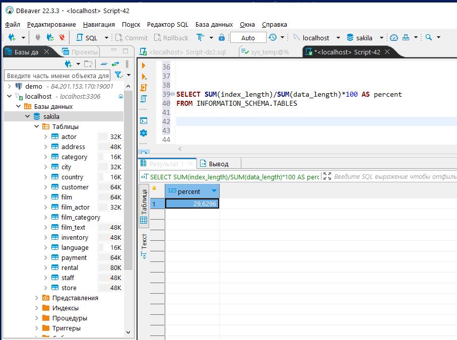
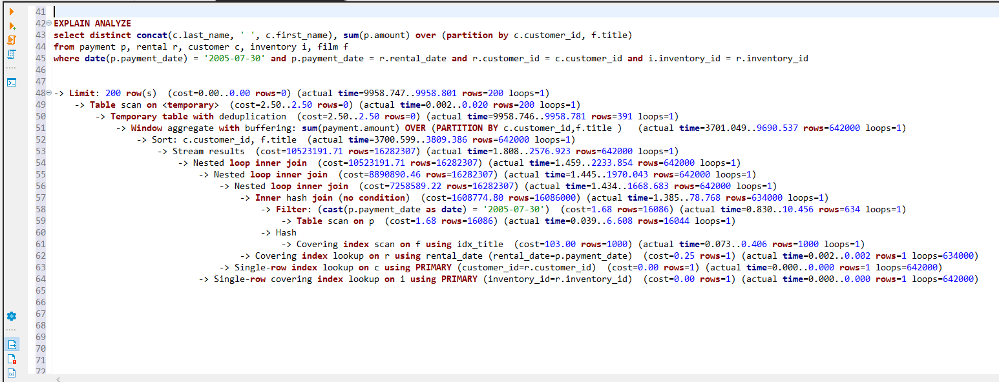
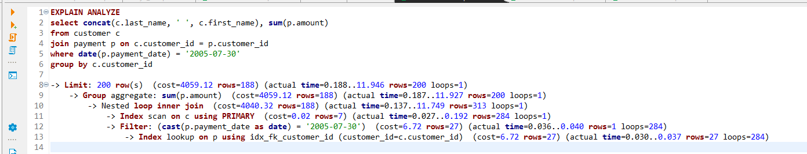

# Домашнее задание к занятию "Индексы" - `Тимохин Виталий`

### Задание 1.

Напишите запрос к учебной базе данных, который вернёт процентное отношение общего размера всех индексов к общему размеру всех таблиц.

```sql
SELECT SUM(index_length)/SUM(data_length)*100 AS percent 
FROM INFORMATION_SCHEMA.TABLES;
```
`Результат выполнения запроса:`



### Задание 2.

Выполните explain analyze следующего запроса:
```sql
select distinct concat(c.last_name, ' ', c.first_name), sum(p.amount) over (partition by c.customer_id, f.title)
from payment p, rental r, customer c, inventory i, film f
where date(p.payment_date) = '2005-07-30' and p.payment_date = r.rental_date and r.customer_id = c.customer_id and i.inventory_id = r.inventory_id
```

`Результат выполнения explain analyze для запроса выше:`



- перечислите узкие места;

` Узкими местами запроса являются:`

`	- использование оконной функции, которая потребовала сортировки 642000 строк.`

`	- операция JOIN пяти таблиц payment, rental, customer, inventory, film. Это дорогостоящие операции по нагрузке на процессор (cost) и по времени выполнения (actual time). Для получения результата достаточно было выполнить операцию JOIN двух таблиц customer, payment. Стоимость отдельных операций на данном этапе достигала cost=10523191.71 количество обрабатываемых сторк достигало rows=16282307.`

`	- считаю операцию DISTINCT лишней т.к. JOIN  выполнялся  по customer_id.`

`	- выше перечисленные операции привели к высокому значению времени выполнения запроса actual time=9958.801 мс.`

- оптимизируйте запрос: внесите корректировки по использованию операторов, при необходимости добавьте индексы.

`Оптимизированный зарос`

```sql
EXPLAIN ANALYZE
select concat(c.last_name, ' ', c.first_name), sum(p.amount) 
from customer c
join payment p on c.customer_id = p.customer_id
where date(p.payment_date) = '2005-07-30'
group by c.customer_id;
```
`Результат выполнения explain analyze для оптимизированного запроса:`



## Дополнительные задания (со звёздочкой*)
Эти задания дополнительные, то есть не обязательные к выполнению, и никак не повлияют на получение вами зачёта по этому домашнему заданию. Вы можете их выполнить, если хотите глубже шире разобраться в материале.

### Задание 3*

Самостоятельно изучите, какие типы индексов используются в PostgreSQL. Перечислите те индексы, которые используются в PostgreSQL, а в MySQL — нет.

*Приведите ответ в свободной форме.*

`В PostgreSQL ипользуются неиспользуемые в MySQL следующие индексы: Bitmap index, Partial index, Function based index.`